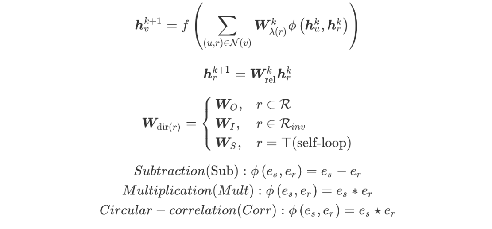

# Awesome paper list

  

A collection of graph embedding, deep learning, recommendation, knowledge graph, heterogeneous graph papers with reference implementations

Table of Contents
=================

   * [Awesome paper list](#awesome-paper-list)
   * [Recommendation](#recommendation)
      * [Large Scale Recommendation](#large-scale-recommendation)
      * [Novel Application](#novel-application)
      * [News Recommendation](#news-recommendation)
      * [Social Recommendation](#social-recommendation)
      * [Review Based Recommendation](#review-based-recommendation)
      * [Multi-Relation Recommendation](#multi-relation-recommendation)
      * [Disentangled Recommendation](#disentangled-recommendation)
      * [Explainable Recommendation](#explainable-recommendation)
   * [Graph](#graph)
      * [Survey](#survey)
      * [Architecture](#architecture)
      * [Theory](#theory)
      * [Graph Modification and Robust](#graph-modification-and-robust)
      * [Understanding](#understanding)
      * [Sampling](#sampling)
      * [Application](#application)
      * [HyperGraph](#hypergraph)
      * [Heterogeneous Information Network](#heterogeneous-information-network)
         * [Architecture](#architecture-1)
         * [Recommendation and Other Application](#recommendation-and-other-application)
      * [Network Representation Learning](#network-representation-learning)
         * [Survey](#survey-1)
      * [Sources](#sources)
         * [Industry Implement](#industry-implement)
         * [Acdamic Implement](#acdamic-implement)
         * [Reading Source](#reading-source)
   * [BayesianDeepLearning](#bayesiandeeplearning)
      * [Survey](#survey-2)
      * [Uncertainty](#uncertainty)
      * [Ensemble](#ensemble)
   * [Others](#others)
   * [Datasets](#datasets)
      * [homegenerous graph dataset](#homegenerous-graph-dataset)
      * [heteregeneous graph datasets](#heteregeneous-graph-datasets)

# Recommendation

## Large Scale Recommendation

- 2017- KDD -  Dynamic Attention Deep Model for Article Recommendation by Learning Human Editors’ Demonstration
  - *Xuejian Wang, Lantao Yu, Kan Ren*
  - *news recommendation*

- 2018 - WWW - [DKN: Deep Knowledge-Aware Network for News Recommendation](https://github.com/hwwang55/DKN)
  - *[Hongwei Wang], Fuzheng Zhang, Xing Xie, Minyi Guo*
  - *news recommendation; knowledge graph*

- 2018 - KDD - [Deep Interest Network for Click-Through Rate Prediction](https://github.com/zhougr1993/DeepInterestNetwork)
  - *Guorui Zhou, Kun Gai, et al*
  - *click prediction*

## Novel Application

- 2018 - Recsys - Learning Consumer and Producer Embeddings for User-Generated Content Recommendation
  - *[Wang-Cheng Kang], [Julian McAuley]*
  - *user based*

- 2019 - ICML - Compositional Fairness Constraints for Graph Embeddings

## News Recommendation

- 2019 - KDD - NPA Neural News Recommendation with personalized attention

- 2013 -WSDM - News Recommendation via Hypergraph Learning: Encapsulation of User Behavior and News Content
  - *Lei Li, Tao Li*

- 2018 - CIKM - [Weave & Rec : A Word Embedding based 3-D Convolutional Network for News Recommendation](https://github.com/dhruvkhattar/WE3CN)

- 2018 - IJCAI - [A3NCF: An Adaptive Aspect Attention Model for Rating Prediction](https://github.com/hustlingchen/A3NCF)
  - *Zhiyong Cheng, Ying Ding, [Xiangnan He], Lei Zhu, Xuemeng Song*

## Social Recommendation

- 2019 - WSDM - [Social Attentional Memory Network: Modeling Aspect- and Friend-level Differences in Recommendation](https://github.com/chenchongthu/SAMN)
  - *[Chong Chen], Min Zhang, et al*

- 2019 - WWW - Graph Neural Networks for Social Recommendation
  - *Wenqi Fan, [Yao Ma], [Jiliang Tang]*

## Review Based Recommendation

- 2019 - CIKM - Spam Review Detection with Graph Convolutional Networks
  - *spam review is hard to detect using the content itself, considering the content with other reviews is important*

- 2019 - EMNLP - Reviews Meet Graphs Enhancing User and Item Representations for recommendation with Hierachical Attentive Graph Neural Network
  - *Chuhan Wu, Fangzhao Wu, Tao Qi, Suyu Ge, Yongfeng Huang, and [Xing Xie]*

- 2019 - KDD - DAML  Dual Attention Mutual Learning between Ratings and reviews

- 2018 - WWW - [Neural At-tentional Rating Regression with Review-level Explanations](https://github.com/chenchongthu/NARRE)
  - *[Chong Chen], [Min Zhang]*

## Sequential Recommendation
- 2019 - TKDE - [Personalizing Graph Neural Networks with Attention Mechanism for Session-based Recommendation](https://github.com/CRIPAC-DIG/A-PGNN)

## Multi-Relation Recommendation

- 2020 - AAAI - [Efficient Heterogeneous Collaborative Filtering without Negative Sampling for Recommendation](https://github.com/chenchongthu/EHCF)
  - *[Chong Chen], [Min Zhang]*
  
## Disentangled Recommendation

- 2019 - NIPS - [Learning Disentangled Representations for Recommendation](https://jianxinma.github.io/)
  - *Jianxin Ma, [Peng Cui]*

## Explainable Recommendation

- 2018 - AAAI - Explainable Recommendation Through Attentive Multi-View Learning

- 2018 - CIKM - RippleNet : Propagating User Preferences on the Knowledge Graph for Recommender Systems

- 2019 - AAAI - Explainable Reasoning over Knowledge Graphs for Recommendation

- [Min Zhang] website (aim at explainable recommender system)

# Graph

## Survey
- 2019  - Representation Learning on Graphs: Methods and Applications
  - *[William L. Hamilton], [Rex Ying], [Jure Leskovec]*
  
- 2019  - A Comprehensive Survey on Graph Neural Networks
  - *Zonghan Wu ,Philip S. Yu*

## Architecture

- 2020 - ICLR - [Geom-GCN: Geometric Graph Convolutional Networks](https://github.com/anonymous-conference-submission/geom-gcn/)
  - *Hongbin Pei, Bingzhe Wei, Kevin Chen-Chuan Chang, Yu Lei, Bo Yang*
  - *图卷积网络已经成功被应用到图表示学习的很多应用当中。但是目前的图卷积网络中仍有两个缺陷限制了他们的表达学习能力，一是在节点信息汇聚的过程中，以往的mean，max pooling操作会丢失掉了节点的结构信息，无法区分一些特殊的非同构数据。二是对于一些disassortative的图，以往的相邻节点的定义方法无法利用上在图结构上距离较远的节点。本文针对以上两个限制，为图卷积网络提出了一种新的邻居节点定义方法和汇聚方式。主要分为三步，节点嵌入，从图结构和节点嵌入空间一起选取相邻节点，两阶段的节点汇聚。最终作者在八个数据集，按照6：2：2的比例划分数据集，超越了GCN和GAT的节点分类效果，并给出了对照试验验证了各个模块的有效性。*

- 2019 - ICML - [Disentangled Graph Convolutional Networks](https://jianxinma.github.io/)
  - *Jinxi Ma, [Peng Cui]*

- 2018 - ICML - Representation Learning on Graphs with Jumping Knowledge Networks
  - *[Keyulu Xu], Chengtao Li, Yonglong Tian, Tomohiro Sonobe,Ken-ichi Kawarabayashi, Stefanie Jegelka*
  - *jump connection;*

- 2019 - ICLR - [Predict then Propagate: Graph Neural Networks meet Personalized PageRank](https://github.com/klicperajo/ppnp)
  - *Johannes Klicpera, Aleksandar Bojchevski, Stephan Günnemann*
  - *page rank;*

## Theory

- 2019 - NIPS - [Break the Ceiling: Stronger Multi-scale Deep Graph Convolutional Networks](https://github.com/PwnerHarry/Stronger_GCN)
  - *Luan, Sitao and Zhao, Mingde and Chang, Xiao-Wen and Precup, Doina*
  - *提出了两种类似于densenet 的图卷积网络结构用于node classification，作者的motivation是从spectruml出发的，和LanczosNet属于同一系列工作*

- 2019 - NIPS - [Diffusion Improves Graph Learning](https://github.com/klicperajo/gdc)
  - *Johannes Klicpera, Stefan Weißenberger, [Stephan Günnemann]*

- 2019 - ICLR - [Graph Wavelet Neural Network](https://github.com/Eilene/GWNN)
  
  - *[Bingbing Xu](https://openreview.net/profile?email=xubingbing%40ict.ac.cn), [Huawei Shen](https://openreview.net/profile?email=shenhuawei%40ict.ac.cn), [Qi Cao](https://openreview.net/profile?email=caoqi%40ict.ac.cn), [Yunqi Qiu](https://openreview.net/profile?email=qiuyunqi%40ict.ac.cn), [Xueqi Cheng](https://openreview.net/profile?email=cxq%40ict.ac.cn)*
  
- 2018 - AAAI - [GraphGAN: Graph Representation Learning with Generative Adversarial Nets](https://github.com/hwwang55/GraphGAN)
  - *[Hongwei Wang], Jia Wang, Jialin Wang,Miao Zhao,Weinan Zhang,Fuzheng Zhang Xing Xie, Minyi Guo*
  
- 2018 - CIKM - [Semi-supervised Learning on Graphs with Generative Adversarial Nets](https://github.com/dm-thu/GraphSGAN)  
  - *[Hongwei Wang], Jia Wang, Jialin Wang,Miao Zhao,Weinan Zhang,Fuzheng Zhang Xing Xie, Minyi Guo*
  
- 2019 - ICML - [Simplifying Graph Convolutional Networks](https://github.com/Tiiiger/SGC)
  - *Wu Felix, Zhang Tianyi, Souza, Amauri, Holanda de Fifty, Christopher, Yu, Tao, Weinberger, Kilian Q.*
  
- 2019 - ICLR - [HOW POWERFUL ARE GRAPH NEURAL NETWORKS](https://github.com/Tiiiger/SGC)
  - *[Keyulu Xu], Weihua Hu, [Jure Leskovec], Stefanie Jegelka*
  
- 2019 - ICLR - [LanczosNet: Multi-Scale Deep Graph Convolutional Networks](https://github.com/lrjconan/LanczosNetwork)
  - *[Renjie Liao], et al*
  
- 2019 - AAAI - [GeniePath: Graph Neural Networks with Adaptive Receptive Paths](https://github.com/lrjconan/LanczosNetwork)
  - *Le Song, Yuan Qi, et al*
  
- 2018 - ICLR - [Graph Attention Networks](https://github.com/PetarV-/GAT)
  - *Petar Veliˇckovi´, Guillem Cucurull, Arantxa Casanova, Adriana Romero, Pietro Li`, Yoshua Bengio*
  
- 2018 - NIPS - [Hierarchical Graph Representation Learning with Differentiable Pooling](https://github.com/RexYing/diffpool)
  - *[Rex Ying], Jiaxuan You, Christopher Morris, Xiang Ren, William L. Hamilton, Jure Leskovec*
  
- 2018 - NIPS - GLoMo: Unsupervisedly Learned Relational Graphs as Transferable Representations
  - *Zhilin Yang, Jake Zhao, Bhuwan Dhingra, Kaiming He, William W. Cohen, Ruslan Salakhutdinov, Yann LeCun*
  
- 2017 - NIPS - [GraphSAGE: Inductive Representation Learning on Large Graphs](http://snap.stanford.edu/graphsage/#code)
  - *[Rex Ying], Jiaxuan You, Christopher Morris, Xiang Ren, William L. Hamilton, Jure Leskovec*
  
- 2018 - NIPS - [Pitfalls of Graph Neural Network Evaluation](https://github.com/shchur/gnn-benchmark)
  - *Shchur  Oleksandr et al*

- 2017 - ICLR - [SEMI-SUPERVISED CLASSIFICATION WITH GRAPH CONVOLUTIONAL NETWORKS](https://github.com/tkipf/gcn)
  - *[Thomas N. Kipf],  [Max Welling]*

## Graph Modification and Robust 

- 2019 - ICLR - Bayesian Graph Convolutional Neural Networks Using Non-Parametric Graph Learning
  - *Soumyasundar Pal, Florence Regol & Mark Coates*

- 2019 - NIPS - Variational Spectral Graph Convolutional Networks
  - *Louis Tiao, Pantelis Elinas, Harrison Nguyen, Edwin V. Bonilla*

- 2019 - NIPS - [Graph Agreement Models for Semi-Supervised Learning](https://github.com/tensorflow/neural-structured-learning/tree/master/research/gam)
  - *Otilia Stretcu · Krishnamurthy Viswanathan · Dana Movshovitz-Attias · Emmanouil Platanios · Sujith Ravi · Andrew*
  - *本文提出了一个基于graph的半监督学习框架。基于graph的半监督学习算法在半监督任务上效果出众，例如label propagation，他们基于的基本假设是一个节点的标签可以通过周围节点的类别来推测。但是在真实的世界中，许多的graph中节点之间存在边并不代表两个节点共属于同一类。本文基于WSDM2018的工作，提出了graph aggrement model，其引入辅助任务帮助判断两个节点之间的边是否有助于当前的主任务，例如分类。并在主任务和辅助任务之间通过co training的方式进行训练，最终在半监督任务上取得了优异的效果，超越了GAT。*

- 2019 - AAAI - [Bayesian graph convolutional neural networks for semi-supervised classification](https://github.com/huawei-noah/BGCN)
  - *Jiatao Jiang, Zhen Cui, Chunyan Xu, Jian Yang*
  - *edge modification;*

- 2019 - ICML - Learning Discrete Structures for Graph Neural Networks

- 2019 - ICML - Are Graph Neural Networks Miscalibrated

- 2019 - ICLR - DEEP GAUSSIAN EMBEDDING OF GRAPHS UNSUPERVISED INDUCTIVE LEARNING VIA RANKING
  - *提出概率建模，variance对应有具体的含义，另外提出ranking，即1 hop node embedding的similarity要大于2 hop node embedding，利用KL来计算similarity。同时，相比于node2vec这样的node embedding算法，该算法能够利用node attribute做到inductive，相比于graph sage，能够做到在test阶段，即使没有link，也能够产生node 的 embedding*
- 2019 - KDD - Robust Graph Convolutional Networks Against Adversaria Attacks  
  - *gcn中每一层特征都用一个gaussian distribution来表征，分布的好处是可以吸收对抗攻击的坏处。另外，设计了基于variance的attention方式，这样可以阻止对抗攻击在graph中的传播*

## Understanding

- 2020 - ICLR - [PairNorm: Tackling Oversmoothing in GNNs](https://drive.google.com/drive/folders/1b2ZvLMcCDVoxXpWsCJhwXhXrQ53d4siR)
  - *Lingxiao Zhao, Leman Akoglu*
  - *解决oversmoothing*

- 2020 - ICLR - [DropEdge: Towards Deep Graph Convolutional Networks on Node Classification]( https://github.com/DropEdge/DropEdge )
  - *Yu Rong, Wenbing Huang, Tingyang Xu, Junzhou Huang*
  - *解决oversmoothing*

- 2020 - ICLR - [Measuring and Improving the Use of Graph Information in Graph Neural Networks]( https://github.com/yifan-h/CS-GNN )
  - *Yifan Hou, Jian Zhang, James Cheng, Kaili Ma, Richard T. B. Ma, Hongzhi Chen, Ming-Chang Yang*

- 2020 - ICLR - Characterize and Transfer Attention in Graph Neural Networks 
  - *GAT在citation数据集上不同node的attention区分度不明显，在PPI上明显。这个attention和不同的数据集有着相关性，利用attention score作为feature vector，可以明显的区分出来不同的dataset。另外，作者尝试利用GAT得到的attention score对edge进行过滤，发现graph中的仅仅保留30-40%边仍能够得到不错的效果*

- 2020 - AAAI - Measuring and Relieving the Over-smoothing Problem for Graph Neural Networks from the Topological View
  - *Deli Chen, Yankai Lin, Wei Li, Peng Li, Jie Zhou, Xu Sun* 
  - *作者发现对于node classification这样的任务，inter class edge是有用的，而intra classi的edge是noisy的。作者提供了两种指标来衡量smoothing。同时作者还提出了两种方法来解决oversmooting，一种是加regularizer，在graph较近的node之间的feature vector的cosine distance变小，而graph上离得比较远的node之间的distance变大，另外一种方法为对graph进行重建，期望graph之间confidence比较高的edge得以保留，confidence比较低的边去除掉。这两种方法来使得在达到较高的层数的时候，performance的衰退变慢。*

## Sampling

- 2019 - KDD - [Cluster-GCN: An Efficient Algorithm for Training Deep and Large Graph Convolutional Networks](https://www.paperweekly.site/papers/3251)

## Application

- 2018 - KDD - [Inductive Matrix Completion Based on Graph Neural Networks](https://github.com/muhanzhang/IGMC)
  - *[Muhan Zhang], Yixin Chen*
  - *该文章提出了一种基于图卷积网络的inductive，并且不使用辅助信息的矩阵补全方法。矩阵补全作为一个经典的问题，在许多领域有着应用，例如推荐系统。以往的方法比如低秩矩阵分解将矩阵分解成两个向量的乘积，他们往往是transductive的，不能够泛化到新的矩阵行和列上，KDD 2018的GCMC应用node-level的图卷积网络在bipartie graph上学习用户和物品特征表达，但其仍属于transductive的方法，而同为KDD 2018的pinsage虽然是inductive的模型，但是要依赖辅助信息如特征，并且特征的质量往往会影响模型的效果。本文提出一种基于图卷积网络的inductive矩阵补全方法，使得模型不依赖特征就可以泛化到新用户和新物品的矩阵补全方法。该方法主要由三步构成，包括了1.抽取包含目标用户和物品的sub-graph；2.为subgraph中不同的节点打上标签；3.graph-level的图卷积网络进行评分预测。最终作者在4个数据集上取得最好的表现效果，值得一提的是在movielens数据集上训练的模型在Douban数据集上进行测试，也能够超越一大部分baseline，显出该方法有着良好的transfer能力。*

- 2018 - KDD - [DeepInf: Social Influence Prediction with Deep Learning](https://github.com/sunqm/pyscf)
  - *Jiezhong Qiu , Jie Tang， et al*

- 2018 - KDD - [Signed Graph Convolutional Network](https://github.com/benedekrozemberczki/SGCN)
  - *yler Derr, Yao Ma, Jiliang Tang*

- 2019 - AAAI - [Signed Graph Convolutional Network](https://github.com/yao8839836/text_gcn)
  - *Liang Yao, Chengsheng Mao, Yuan Luo*

- 2018 - KDD - [Graph Convolutional Matrix Completion](https://github.com/riannevdberg/gc-mc)
  - *Rianne van den Berg, [Thomas N. Kipf],  [Max Welling]*

- 2018 - KDD - PinSage: Graph Convolutional Neural Networks for Web-Scale Recommender Systems
  - *[Rex Ying], Ruining He, Kaifeng Chen, Pong Eksombatchai, William L. Hamilton, [Jure Leskovec]*

- 2020 - ICLR - Composition-based Multi-Relational Graph Convolutional Networks 
  - *Shikhar Vashishth, Soumya Sanyal, Vikram Nitin, Partha Talukdar*
  - *propose the relation embedding in the aggregation as below to solve the over-parameterization problem*

- 2019 - AAAI - [End-to-end Structure-Aware Convolutional Networks for Knowledge Base Completion](https://github.com/JD-AI-Research-Silicon-Valley/SACN)

- 2019 - AAAI - [Modeling Relational Data with Graph Convolutional Networks](https://github.com/tkipf/relational-gcn)
  - *Michael Schlichtkrull, [Thomas N. Kipf]*

- 2018 - NIPS - [SimplE Embedding for Link Prediction in Knowledge Graphs](https://github.com/Mehran-k/SimplE)
  - *[Seyed Mehran Kazemi], David Poole*

- 2017 - AAAI - [Convolutional 2D Knowledge Graph Embeddings](https://github.com/TimDettmers/ConvE)
  - *[Tim Dettmers], Pasquale Minervini, Pontus Stenetorp, Sebastian Riedel*

- 2013 - NIPS - [Translating Embeddings for Modeling Multi-relational Data](https://github.com/thunlp/KB2E)
  - *Antoine Bordes, Nicolas Usunier, Alberto Garcia-Duran, Jason Weston, Oksana Yakhnenko*

## HyperGraph

- 2020 - ICLR - [Hyper-SAGNN: a self-attention based graph neural network for hypergraphs](https://drive.google.com/drive/folders/1kIOc4SlAJllUJsrr2OnZ4izIQIw2JexU?usp=sharing)
  - *Ruochi Zhang,  Yuesong Zou,  Jian Ma*

- 2019 - AAAI - [Hypergraph Neural Networks](https://github.com/Yue-Group/HGNN)
  - *Yifan Feng, Haoxuan You, Zizhao Zhang, Rongrong Ji, [Yue Gao]*

- 2018 - AAAI - [Structural Deep Embedding for Hyper-Networks](https://github.com/tadpole/DHNE)
  - *Ke Tu, [Peng Cui], Xiao Wang, Fei Wang, Wenwu Zhu*

## Heterogeneous Information Network

### Architecture

- 2019 - NIPS - [Graph Transformer Networks](https://github.com/seongjunyun/Graph_Transformer_Networks)
  - *Ke Tu, [Peng Cui], Xiao Wang, Fei Wang, Wenwu Zhu*

- 2019 - WWW - [Heterogeneous Graph Attention Network](https://github.com/Jhy1993/HAN)
  - *Houye Ji, [Chuan Shi], [Peng Cui] et al*

- 2019 - AAAI - [Relation Structure-Aware Heterogeneous Information Network Embedding](https://github.com/rootlu/RHINE)
  - *Yuanfu Lu, [Chuan Shi], Linmei Hu, Zhiyuan Liu*

- 2018 - CIKM - Are Meta-Paths Necessary ? Revisiting Heterogeneous Graph Embeddings
  - *[Rana Hussein]*

- 2018 - WWW - [Deep Collective Classification in Heterogeneous Information Networks](https://github.com/zyz282994112/GraphInception.git)

- 2018 - KDD - PME : Projected Metric Embedding on Heterogeneous Networks for Link Prediction

- 2017 - KDD - [metapath2vec: Scalable Representation Learning for Heterogeneous Networks](https://github.com/apple2373/metapath2vec)
  - *[Yuxiao Dong]* 	

###  Recommendation and Other Application

- 2019 - CIKM - [Relation-Aware Graph Convolutional Networks for Agent-Initiated Social E-Commerce Recommendation](https://github.com/xfl15/RecoGCN)
  - *relation aware aggregator; metapath based receptive field sampler; co-attention fusion;*

- 2019 - KDD - Metapath-guided Heterogeneous Graph Neural Network for Intent Recommendation

- 2019 -EMNLP - Heterogeneous Graph Attention Networks for Semi-supervised Short Text Classification

- 2017 - KDD - [Meta-Graph Based Recommendation Fusion over Heterogeneous Information Networks](https://github.com/HKUST-KnowComp/FMG)
  - *Huan Zhao, anming Yao, Jianda Li, Yangqiu Song and Dik Lun Lee*

- 2019 - AAAI - [Cash-out User Detection based on Attributed Heterogeneous Information Network with a Hierarchical Attention Mechanism](https://github.com/librahu/HACUD)
  - *Binbin Hu, Zhiqiang Zhang, [Chuan Shi], Jun Zhou, Xiaolong Li, Yuan Qi*

- 2018 - KDD - [Leveraging Meta-path based Context for Top- N Recommendation with A Neural Co-Attention Model](https://github.com/librahu/MCRec)
  - *Binbin Hu, [Chuan Shi], Wayne Xin Zhao, [Philip S. Yu]*

- 2018 - IJCAI - [Aspect-Level Deep Collaborative Filtering via Heterogeneous Information Networks](https://github.com/ahxt/NeuACF)
  - *Xiaotian Han, [Chuan Shi], Senzhang Wang, [Philip S. Yu], Li Song*

## Network Representation Learning

### Survey

- 2018 - A Survey on Network Embedding
  - *[Peng Cui](https://arxiv.org/search/cs?searchtype=author&query=Cui%2C+P), [Xiao Wang](https://arxiv.org/search/cs?searchtype=author&query=Wang%2C+X), [Jian Pei](https://arxiv.org/search/cs?searchtype=author&query=Pei%2C+J), [Wenwu Zhu](https://arxiv.org/search/cs?searchtype=author&query=Zhu%2C+W)*

- 2018 - A Tutorial on Network Embeddings
  - *[Haochen Chen](https://arxiv.org/search/cs?searchtype=author&query=Chen%2C+H), [Bryan Perozzi](https://arxiv.org/search/cs?searchtype=author&query=Perozzi%2C+B), [Rami Al-Rfou](https://arxiv.org/search/cs?searchtype=author&query=Al-Rfou%2C+R), [Steven Skiena](https://arxiv.org/search/cs?searchtype=author&query=Skiena%2C+S)*

- 2017 - IJCAI - [TransNet : Translation-Based Network Representation Learning for Social Relation Extraction](https://github.com/thunlp/TransNet)
  - *Cunchao Tu, Zhengyan, Maosong Sun* 

- 2019 - AAAI - TransConv: Relationship Embedding in Social Networks

- 2019 - ICLR - [DEEP GRAPH INFOMAX](https://github.com/PetarV-/DGI)
  - Petar Velickovi ˇ c´, William L. Hamilton, [Yoshua Bengio] et al

- 2018 IJCAI - [ANRL: Attributed Network Representation Learning via Deep Neural Networks](https://github.com/cszhangzhen/ANRL)
  - *Zhen Zhang, Hongxia Yang, Jiajun Bu, Sheng Zhou, Pinggang Yu, Jianwei Zhang, Martin Ester, Can Wang*

## Sources

###  Industry Implement

  - [alimama euler framework](https://github.com/alibaba/euler)
  - [tencent angel frame work](<https://github.com/Angel-ML/angel>)
  - [tencent plato]( https://github.com/Tencent/plato )

### Acdamic Implement
  - [gated-graph-neural-network-samples](https://github.com/Microsoft/gated-graph-neural-network-samples)
  - [Graph-neural-networks jupyter tutorial](https://github.com/SeongokRyu/Graph-neural-networks)
  - [Deep Graph Library (DGL) Python package](https://docs.dgl.ai/index.html)
  - [pitafall: gnn model collection](https://github.com/shchur/gnn-benchmark)
  - [pytorch_geometric](https://github.com/rusty1s/pytorch_geometric)
  - [Liaojunjie: gnn model collection](https://github.com/lrjconan/LanczosNetwork)
  - [node embedding from deepwalk to struc2vec](https://github.com/shenweichen/GraphEmbedding)
  - [spektral](https://github.com/danielegrattarola/spektral)
  - **[stellargraph including metapath2vec](https://github.com/stellargraph/stellargraph)**
  - [visualization of graph- graph tool]( https://graph-tool.skewed.de/ )
  - [analysis the spectral of graph pyqsp]( https://github.com/epfl-lts2/pygsp )

### Reading Source
  - [Tsinghua University Graph papers reading list](https://github.com/thunlp/GNNPapers)
  - [gnn literature](https://github.com/naganandy/graph-based-deep-learning-literature/blob/master/conference-publications/README.md)
  - [MIA reading group](https://github.com/shagunsodhani/Graph-Reading-Group)
  - [awesome-network-embedding](https://github.com/chihming/awesome-network-embedding)
  - [dynamic graph](https://github.com/woojeongjin/dynamic-KG)
  - [zhihu link for graph](https://zhuanlan.zhihu.com/p/55944583)
  - [spatial-temporal graph](https://github.com/Eilene/spatio-temporal-paper-list/issues/1)
  - [Technische Universität München](https://www.kdd.in.tum.de/forschung/machine-learning-for-graphsnetworks/)
  - [graph-adversarial-learning-literature](https://github.com/YingtongDou/graph-adversarial-learning-literature)

# BayesianDeepLearning

##  Survey

- 2018 - NIPS - Recent Advances in Autoencoder-Based Representation Learning
  
- *Michael Tschannen, Olivier Bachem, Mario Lucic*
  
  
  

## Uncertainty

- 2017 - ICML - [On Calibration of Modern Neural Networks](https://github.com/gpleiss/temperature_scaling)

- 2019 - NIPS - Variational Graph Convolutional Networks

- 2019 - ICML -[ Are Graph Neural Networks Miscalibrated?](https://github.com/PurdueMINDS/GNNsMiscalibrated)
  - *Leonardo Teixeira, Brian Jalaian, Bruno Ribeiro *
  - *calibrated的定义为，在多分类模型中，softmax输出的概率是否和预测正确的频率相吻合，例如模型对这批数据的预测为0.8，那么10次给出这个标签，8次应该是对的。random classifier is a perfectly calibrated model so it is a orthogonal metric to model accuracy。该文章调研了之前比较成熟的calibration method包括了MC dropout和temprature scaling，显示了他们并不一定都对GNN有效果，但本篇文章并没有提出来任何改善GNN的calibration techniques。*
- 2019 - NIPS - [Using Self-Supervised Learning Can Improve Model Robustness and Uncertainty](https://github.com/hendrycks/ss-ood) 
  - *Dan Hendrycks, Mantas Mazeika, Saurav Kadavath, Dawn Song*
  - *该文在CV的分类任务上，在原有cross entropy loss基础上，附加了一种基于rotation的self-supervised loss用来增强模型的鲁棒性，可以应对噪声标签，噪声图片输入，对抗样本输入，out of distribution sample。在每个任务上均能提升5个点左右。该方法简单有效，可以作为plug添加到许多CV分类任务中*

- 2019 - ICCV - [Probabilistic Face Embedding](https://github.com/seasonSH/Probabilistic-Face-Embeddings)

- 2017 - NIPS - What Uncertainties Do We Need in Bayesian  Deep Learning for Computer Vision?

- 2016 - ICML - Dropout as a Bayesian Approximation Representing Model Uncertainty in Deep Learning

- 2019 - NIPS - [Uncertainty posters](https://nips.cc/Conferences/2019/ScheduleMultitrack?session=15553)

- 2019 - ICLR - [Modeling Uncertainty with Hedged Instance Embedding](https://github.com/google/n-digit-mnist)

- 2019 - thisis - Uncertainty Quantification in Deep Learning

- 2019 - [Uncertainty Quantification in Deep Learning](https://www.inovex.de/blog/uncertainty-quantification-deep-learning/)

- 2019 - NIPS - Practical Deep Learning with Bayesian Principles

## Ensemble

- 2018 - NIPS - [Multimodal Generative Models for Scalable Weakly-Supervised Learning](https://github.com/mhw32/multimodal-vae-public)

- 2014 - NIPS - Generalized Product of Experts for Automatic and Principled Fusion of Gaussian Process Predictions

# Others

- 2020 - CVPR - [CONTRASTIVE REPRESENTATION DISTILLATION](https://github.com/HobbitLong/RepDistiller)   

- 2017 - NIPS - Simple and Scalable Predictive Uncertainty Estimation using Deep Ensembles

- 2019 - NIPS - A Simple Baseline for Bayesian Uncertainty in Deep Learning

- 2020 - AISTATS - [Confident Learning Estimating Uncertainty in Dataset Labels](https://github.com/cgnorthcutt/cleanlab)

## attack

#  Datasets

## homegenerous graph dataset

- **PubMed Diabetes**
  - The Pubmed Diabetes dataset consists of 19717 scientific publications from PubMed database pertaining to diabetes classified into one of three classes. The citation network consists of 44338 links. Each publication in the dataset is described by a TF/IDF weighted word vector from a dictionary which consists of 500 unique words. The README file in the dataset provides more details.
  - Download Link:
    - https://linqs-data.soe.ucsc.edu/public/Pubmed-Diabetes.tgz
  - Related Papers:
    - Galileo Namata, et. al. "Query-driven Active Surveying for Collective Classification." MLG. 2012.

- **Cora**
  - The Cora dataset consists of 2708 scientific publications classified into one of seven classes. The citation network consists of 5429 links. Each publication in the dataset is described by a 0/1-valued word vector indicating the absence/presence of the corresponding word from the dictionary. The dictionary consists of 1433 unique words. The README file in the dataset provides more details.
  - Download Link:
    - https://linqs-data.soe.ucsc.edu/public/lbc/cora.tgz
  - Related Papers:
    - Qing Lu, and Lise Getoor. "Link-based classification." ICML, 2003.
    - Prithviraj Sen, et al. "Collective classification in network data." AI Magazine, 2008.

other useful datasets link:
- citation dataset
  - https://linqs.soe.ucsc.edu/data

## heteregeneous graph datasets

- **IMDB Datasets**
  - MovieLens Latest Dataset which consists of 33,000 movies. And it contains four types of nodes: movie, director, actor and actress, connected by two types of relations/link: directed link and actor/actress staring link. Each movie is assigned with a set of class labels, indicating generes of the movie. For each movie, we extract a bag of words vector of all the plot summary about the movie as local features, which include 1000 words.
  - Download Link:
    - https://github.com/trangptm/Column_networks/tree/master/data
  - Related Papers:
    - T. Pham, et al. "Column networks for collective classification." In AAAI, 2017.
    - Zhang, Yizhou et al. "Deep Collective Classification in Heterogeneous Information Networks" In WWW, 2018.

other useful dataset links

- processed Datasets
  - https://github.com/librahu/Heterogeneous-Information-Network-Datasets-for-Recommendation-and-Network-Embedding/blob/master/README.md

[Octavian Eugen Ganea]: http://people.inf.ethz.ch/ganeao/
[Maximilian Nickel]: https://mnick.github.io/project/geometric-representation-learning/

[Chuan Shi]: http://shichuan.org/ShiChuan_ch.html
[Xing Xie]: https://www.microsoft.com/en-us/research/people/xingx/#!representative-publications
[Tim Dettmers]: http://timdettmers.com/about/
[Seyed Mehran Kazemi]: https://www.cs.ubc.ca/~smkazemi/
[Xiangnan He]: https://www.comp.nus.edu.sg/~xiangnan/
[Hongwei Wang]: https://cs.stanford.edu/~hongweiw/
[Peng Cui]: http://pengcui.thumedialab.com/
[William L. Hamilton]: https://williamleif.github.io/
[Yue Gao]: http://www.gaoyue.org/tsinghua/pubs/index.htm
[Xiaofei He]: http://www.cad.zju.edu.cn/home/xiaofeihe/
[Thomas N. Kipf]: https://tkipf.github.io/
[Max Welling]: https://staff.fnwi.uva.nl/m.welling/
[Rex Ying]: https://cs.stanford.edu/people/rexy/
[Lei Zheng]: https://lzheng21.github.io/publications/
[Jure Leskovec]: https://cs.stanford.edu/~jure/
[Wang-Cheng Kang]: http://cseweb.ucsd.edu/~wckang/
[Julian McAuley]:  https://cseweb.ucsd.edu/~jmcauley/
[Rana Hussein]:  https://exascale.info/members/rana-hussein/
[Yuxiao Dong]:  https://ericdongyx.github.io/
[Renjie Liao]: http://www.cs.toronto.edu/~rjliao/
[Min Zhang]: http://www.thuir.org/group/~mzhang/
[Yao Ma]: http://cse.msu.edu/~mayao4/publications.html
[Jiliang Tang]: http://www.cse.msu.edu/~tangjili/publication.html
[jian tang]:  https://jian-tang.com/
[Keyulu Xu]: http://keyulux.com/
[Philip S. Yu]:  https://www.cs.uic.edu/~psyu
[Muhan Zhang]: https://muhanzhang.github.io/
[Stephan Günnemann]: https://www.in.tum.de/daml/startseite/
[Chong Chen]: https://github.com/chenchongthu/