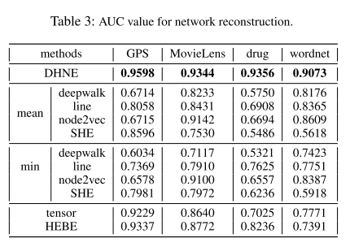
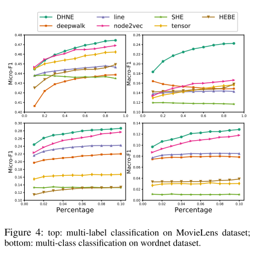

- **Structural Deep Embedding for Hyper-Networks (AAAI 2018)**
  - Ke Tu, [Peng Cui], Xiao Wang, Fei Wang, Wenwu Zhu
  - [Paper](https://arxiv.org/abs/1711.10146)

This paper make the assumption that the three-tuple Heterogeneous hyperedge (user, movie, tag) can't be broken down into edges with only two vertexes, which we called indecomposable. So they made two definition to solve the Heterogeneous hypergraph embedding. The author call this hyperedge as Heterogeneous cause the vertexes in this graph is in different types.

1. defination 1: fisrt-order proximity, if there exists a hyperedge among these N vertexes, the first-order proximity ofthese N vertexes is de- fined as 1, but this implies no first-order proximity for any subsets ofthese N vertexes.
2. defination 2: The second-order Proximity ofhyper-network mea- sures the proximity of two nodes with respect to their neighborhood structures.   For any node vi ∈ Ei, Ei/vi is defined as a neighborhood of vi. If vi’s neighborhoods {Ei/vi for any vi ∈ Ei} are similar to vj’s, then vi’s em- bedding xi should be similar to vj’s embedding xj.

and the fist defination first-order proximity is preserved by:
1. compute the joint representation for the hyperedge consist of 3 vertexes
$$\mathbf { L } _ { i j k } = \sigma \left( \mathbf { W } _ { a } ^ { ( 2 ) } * \mathbf { X } _ { i } ^ { a } + \mathbf { W } _ { b } ^ { ( 2 ) } * \mathbf { X } _ { j } ^ { b } + \mathbf { W } _ { c } ^ { ( 2 ) } * \mathbf { X } _ { k } ^ { c } + \mathbf { b } ^ { ( 2 ) } \right)$$
2. get the similarity of the three vertexes
$$\mathbf { S } _ { i j k } \equiv \mathcal { S } \left( \mathbf { X } _ { i } ^ { a } , \mathbf { X } _ { j } ^ { b } , \mathbf { X } _ { k } ^ { c } \right) = \sigma \left( \mathbf { W } ^ { ( 3 ) } * \mathbf { L } _ { i j k } + \mathbf { b } ^ { ( 3 ) } \right)$$
3. use the binary crossentropy
$$\mathcal { L } _ { 1 } = - \left( \mathbf { R } _ { i j k } \log \mathbf { S } _ { i j k } + \left( 1 - \mathbf { R } _ { i j k } \right) \log \left( 1 - \mathbf { S } _ { i j k } \right) \right)$$

and the second defination second-order proximity is preserved by:
1. Get the neighborhood of the vertex. $\mathbf { H }$ is the incidence matrix. Get the adjance matrix as $\mathbf { A } = \mathbf { H } \mathbf { H } ^ { T } - \mathbf { D } _ { v }$. the i-th row of adjacency ma- trix A shows the neighborhood structure of vertex $v_i$.
2. Use autoencoder to make the nodes with similar neighborhoods hava similar latent representations, and the second-oder proximity is preserved. Notice that, each type of vertexes' adjacent representation is putted to different autoencoder, this implies each vertexes only consider the neighborhood in one type. And I think this not meet his assumptions-definination 2.

$$\begin{aligned} \mathbf { X } _ { i } & = \sigma \left( \mathbf { W } ^ { ( 1 ) } * \mathbf { A } _ { i } + \mathbf { b } ^ { ( 1 ) } \right) \\ \hat { \mathbf { A } } _ { i } & = \sigma \left( \hat { \mathbf { W } } ^ { ( 1 ) } * \mathbf { X } _ { i } + \hat { \mathbf { b } } ^ { ( 1 ) } \right) \end{aligned}$$

And the autoencoder is trained as follows:

$$\left\| \operatorname { sign } \left( \mathbf { A } _ { i } \right) \odot \left( \mathbf { A } _ { i } - \hat { \mathbf { A } } _ { i } \right) \right\| _ { F } ^ { 2 }$$

So to simitanneously keep the first-order and second-order proximity, the final loss is:
$$\mathcal { L } = \mathcal { L } _ { 1 } + \alpha \mathcal { L } _ { 2 }$$.

The experiment is done at four datasets, and three tasks as below:

